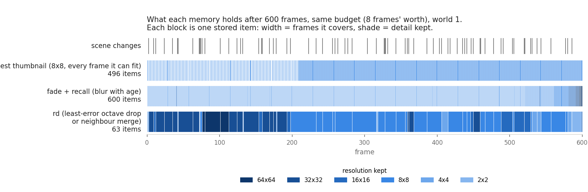
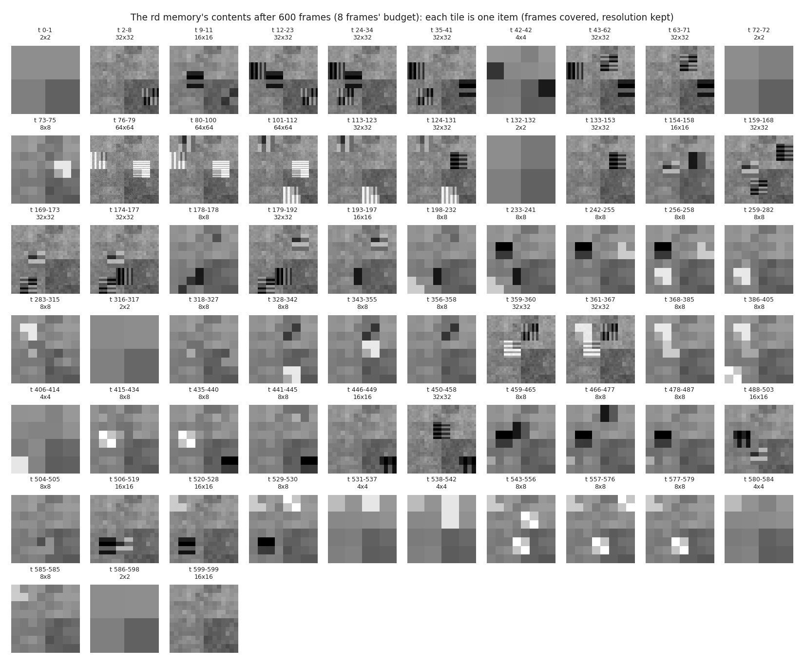
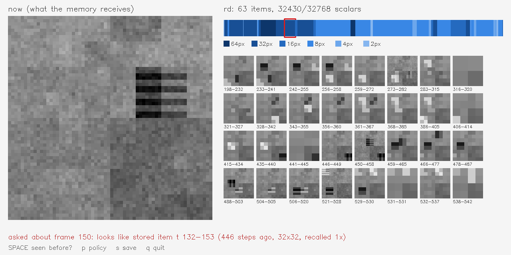

# SihtiMuisti

> A camera memory with a fixed storage budget. Old moments can **lose octaves** (Sihti's residues, dropped finest first) or **fold into their neighbours** (the merge that won [TransformerToX](https://github.com/anttiluode/TransformerToX)). Which of these, used how, still answers "have I seen this?" and "when was that object here?"

This repo came out of TransformerToX. There, keeping evicted tokens by **similarity merge** worked on all three models, and blurring them by **time band** worked on one. The question here is the picture version of that. [Sihti](https://github.com/anttiluode/Sihti) already stores an image as a lossless stack of octave residues, so a memory can blur a frame by dropping its top residues. Which memory layout answers questions best when storage is tight?

Everything is NumPy and runs on a CPU in a few minutes. There's also a live webcam demo.



## How it works

**Octaves with exact cost.** Frames are 64×64 grey. Each one is stored as an orthonormal Haar stack (`haar.py`), which is the Sihti residue identity in its critically sampled form. A full frame is exactly 4,096 numbers. Dropping its finest octave leaves exactly 1,024, and the error that adds is exactly the energy of the dropped band. "Blur a memory by one octave" is therefore a precise operation with a precise saving. Every stored item also costs 2 numbers of metadata (how many frames it covers and their mean time).

**A test world where detail provably matters** (`world.py`). The stream is 600 frames of a textured room with 16 objects coming and going, sometimes moving mid-visit. The objects come in 8 **twin pairs**. Twins are identical except for stripe orientation, at a period of 2, 4 or 8 px. On the 8-px grid those stripes land in exactly one octave. So "was this X or its twin?" can only be answered by a memory that still holds that octave for that moment. A tie between twins shows up as roughly 50%.

**Two kinds of question, one scorer for everyone** (`scorer.py`):

- *Moment*: "have I seen this view before?" The scorer sums the evidence that the query is a noisy copy of the item, over the octaves the item still holds. A dropped octave gives no evidence either way.
- *Object*: "when was this object here?" The clean object picture is slid over every position of each item, at the item's own resolution. That makes it position-invariant: the object is found wherever it stood.

**The memories** (`memory.py`). All of them are charged the same number of scalars.

| policy | what it keeps |
|---|---|
| `keyframes` | full-resolution frames, thinned to even coverage in time |
| `thumbnails_L1..L5` | every frame it can fit at one fixed resolution (32² … 2²) |
| `merge_any` | full resolution; merges the two items whose merge loses least (Ward). The TransformerToX winner |
| `merge_adjacent` | the same, but only neighbours in time. This is online event segmentation |
| `fade` | new frames arrive sharp; the item furthest above its target blur for its age (`log2(1+age)`) drops an octave |
| `fade_recall` | as `fade`, but each doubling of how often an item was recalled buys it one octave of protection |
| `rd`, `rd_recall` | no age rule. Repeatedly do whichever of *drop one octave of one item* or *merge two time-neighbours* adds the least squared error. `rd_recall` weights that error by (1 + recalls) |

**The race** (`race.py`). During the stream, questions are asked at random, 70% of them about a "hot" set of 8 moments and 4 objects. The item a question retrieves counts as recalled. At the end, 64 final questions per world are asked: 12 hot, and 52 cold that were never asked about.

## Gate 0: exactness

`pytest` (19 tests) checks the following:

- The Haar stack is orthonormal and lossless, and all 4,096 coefficients are counted.
- The loss from dropping an octave, and from any merge including mixed-resolution ones, equals the actual reconstruction error.
- Every policy stays within budget at every step, and the merging and fading policies never silently drop a frame.
- Each twin pair differs in exactly one octave.
- The object scorer finds an object at any position and rejects its twin.

## Gate 1: pre-registered race (worlds 1–5)

Pre-registration: [`docs/prereg/gate1-memory-race.md`](docs/prereg/gate1-memory-race.md). The primary test was that **`fade_recall` beats both keyframes and the best thumbnail at both budgets.** The best thumbnail level is picked after seeing the scores, which makes it a stronger baseline than any real user would have.

**Run 1 was invalid, and it is kept** (`results/gate1_run1_INVALID_scorer_bug.json`). Its unbounded `full` memory answered only 67.5% of object questions, where a complete sharp memory should answer nearly all of them. The object scorer compared the template with the background mean instead of comparing the stored window with the background. It was fixed, and a validity check was added **before** rerunning: the full memory must score at least 95% on both question kinds. Nothing else changed. Details are in the amendment inside the pre-registration.

**Run 2** (`results/gate1.json`, valid: full memory 100% / 100%). **Classification: `MIXED`.**

## Gate 2: confirming the unplanned winner on fresh worlds (6–15)

In Gate 1 the strongest row was `rd`, a secondary policy. A row picked by looking can't be confirmed on the same data, so Gate 2 was pre-registered ([`docs/prereg/gate2-rd-confirmation.md`](docs/prereg/gate2-rd-confirmation.md)) on 10 worlds nobody had looked at. Its primary test was that **`rd` beats keyframes and the best thumbnail at both budgets.** The code was frozen. **Classification: `MIXED`**, with the same shape as Gate 1.

### Final accuracy, Gate 2 (640 questions per row; Gate 1 in `results/gate1.json` agrees within a few points)

| memory | 8 frames' budget (1.3%) | moments | objects | 32 frames' budget (5.3%) | moments | objects |
|---|---:|---:|---:|---:|---:|---:|
| full (reference) | 100.0 | 100.0 | 100.0 | 100.0 | 100.0 | 100.0 |
| keyframes | 25.2 | 12.9 | 61.9 | 68.8 | 58.3 | **100.0** |
| best thumbnail (L3 / L1) | **88.9** | **99.8** | 56.2 | 92.8 | 95.6 | 84.4 |
| merge_any | 18.4 | 9.6 | 45.0 | 63.9 | 53.3 | 95.6 |
| merge_adjacent | 18.9 | 14.4 | 32.5 | 69.1 | 60.4 | 95.0 |
| fade | 79.4 | 98.1 | 23.1 | 88.4 | 99.0 | 56.9 |
| fade_recall | 84.5 | 98.1 | 43.8 | 91.4 | 98.3 | 70.6 |
| **rd** | 85.2 | 84.4 | **87.5** | **97.2** | 96.2 | **100.0** |
| rd_recall | 84.2 | 84.0 | 85.0 | 96.9 | 96.0 | 99.4 |

Object accuracy by the octave the twins differ in, Gate 2, 8 frames' budget (50% = can't tell twins apart):

| memory | period 2 px | 4 px | 8 px |
|---|---:|---:|---:|
| best thumbnail (L3, 8×8) | 60.0 | 53.3 | 55.0 |
| fade_recall | 40.0 | 43.3 | 50.0 |
| **rd** | **80.0** | **88.3** | **97.5** |

## What the results say

- **At 5.3% of full storage, `rd` is the best memory tested, in both gates.** It scored 97.2% against 92.8% for the best thumbnail. It answers every object question (twins included) while keeping moment recognition at 96%.
- **At 1.3% of storage it trades one skill for the other.** `rd` tells twins apart 87.5% of the time, where thumbnails are at coin-flip level (56%). But it loses on "have I seen this view?", 84% against 99.8%. The reason is that to afford detail it merges neighbouring frames across scene changes, so the merged item's mean time can land in the wrong scene. The best thumbnail wins the pooled score here (88.9 vs 85.2) because three-quarters of the final questions (48 of 64) are moment questions. That weighting was pre-registered.
- **Blur-with-age (`fade`) is not the useful idea on its own.** It's never better than storing every frame small. Uniform age-blur spends its detail on recent frames, which here are no more likely to be asked about than any others.
- **Recall helps the age rule, and does little for `rd`.** `fade_recall` beats `fade` on hot questions in both gates (84.2 vs 74.2 and 94.2 vs 82.5), and on cold ones too. `rd_recall` against `rd` is within noise.
- **Merging alone, at full resolution, is bad for pictures.** With only 7 or 31 sharp items, there's nothing left for "have I seen this view?" The TransformerToX winner needs octaves beside it. That combination is what `rd` is: merge where the scene stood still, drop octaves where the detail was only noise or texture nobody needs.
- **`rd`'s item boundaries look aligned with scene changes** in the timeline figure. That's by eye and wasn't measured. Picking the cheapest merge turns out to be an event segmenter, which is the "sorter" idea from TransformerToX, here across time.



## Limits

- The world is synthetic and built so that detail matters. Real footage has less clean octave structure and a moving camera, and no real video has been tested.
- There are two budgets, 15 worlds and 64×64 grey only. The shared background model (mean and variance per octave, about 11k scalars) sits outside every budget and is the same for all policies.
- Moment answers are judged by scene configuration, so the metric doesn't reward "the right second", only "the right scene".
- **Prior art.** Rate-distortion allocation of wavelet coefficients is classic image coding. JPEG 2000 quality layers do exactly this. Merging adjacent similar frames into a long-term memory is what MovieChat (2023) and MA-LMM (2024) do for video-language models. What's specific here is only the combination, run on one budget with one exact cost, plus the measured trade-off between telling twins apart and recognising moments.

## Run

```bash
pip install -e ".[test]"
pytest -q
python -m experiments.run_gate1                                   # Gate 1, ~4 min
python -m experiments.run_gate1 --seeds 6,7,8,9,10,11,12,13,14,15 --primary rd --out results/gate2.json
python -m experiments.render_figures
```

### Live demo

```bash
pip install opencv-python
python demo/live_memory.py                    # webcam 0 (untested here: no camera in the build machine)
python demo/live_memory.py --video clip.mp4
python demo/live_memory.py --synthetic 1      # the test world, no camera needed
```

The left panel shows the camera as the memory receives it. The right panel shows the timeline of stored items, where width is time covered and shade is detail kept, above the items themselves as the memory can reconstruct them.

- **SPACE** asks "have I seen this?" with the current view. The matching item is outlined and counted as recalled.
- **p** cycles through `rd`, `fade_recall` and `thumbnails_L3`.

Point the camera at the room, walk out, bring an object back and press SPACE.



## Map

- `src/sihtimuisti/haar.py`: orthonormal Haar octaves (exact cost, exact loss)
- `src/sihtimuisti/world.py`: twin-pair room stream
- `src/sihtimuisti/memory.py`: all policies at equal scalar budget
- `src/sihtimuisti/scorer.py`: per-octave evidence for moment and object questions
- `src/sihtimuisti/race.py`: stream, online recalls, final questions
- `experiments/run_gate1.py`: Gates 1 and 2
- `experiments/render_figures.py`: README figures
- `demo/live_memory.py`: webcam / video / synthetic live memory
- `docs/prereg/`: pre-registrations, with the amendment for the invalid run
- `results/`: frozen receipts, logs and figures
